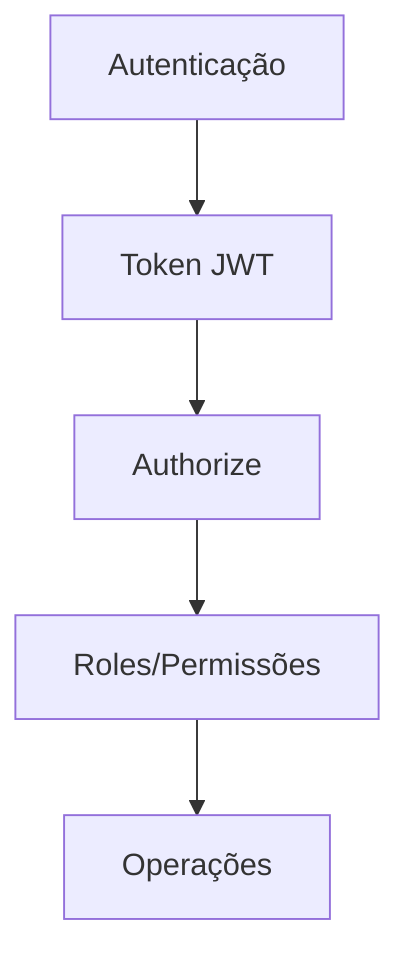
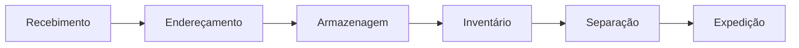
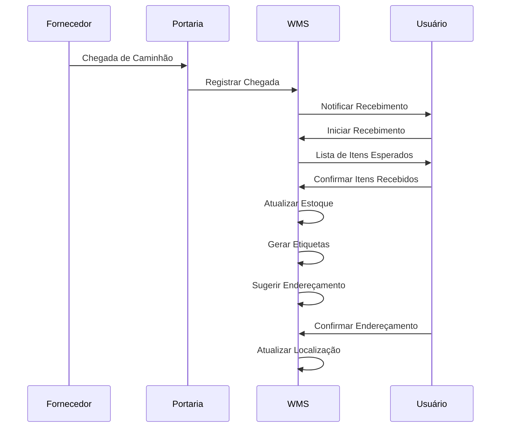
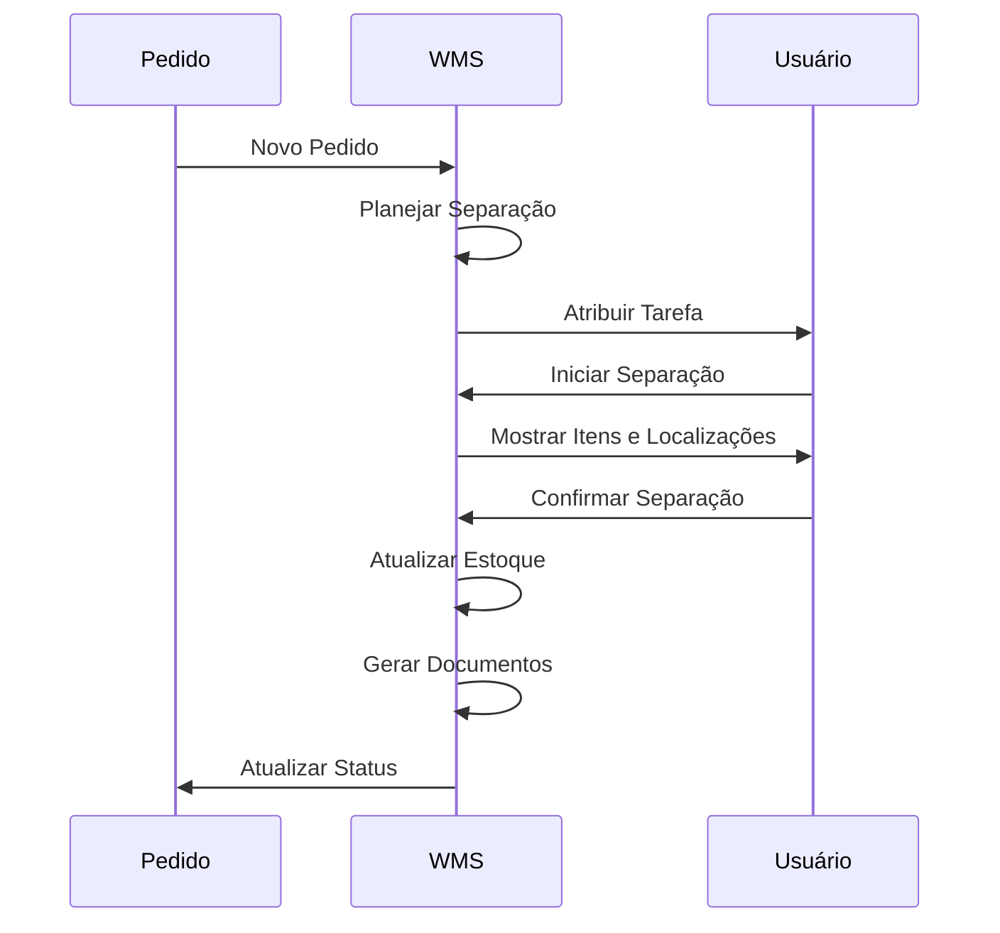

# Arquitetura Técnica do Sistema WMS

## 📚 Visão Geral da Arquitetura

O sistema WMS segue uma arquitetura em camadas (layered architecture) com separação clara de responsabilidades:

```
┌───────────────────────────────────────────────────────┐
│                    APRESENTAÇÃO (API)                  │
│  ┌─────────────┐  ┌─────────────┐  ┌───────────────┐  │
│  │ Controllers │  │ Middlewares │  │  Validação    │  │
│  └─────────────┘  └─────────────┘  └───────────────┘  │
└───────────────────────────┬───────────────────────────┘
                            │
┌───────────────────────────▼───────────────────────────┐
│                    APLICAÇÃO                          │
│  ┌────────────────┐  ┌────────────────┐             │
│  │  Serviços      │  │    DTOs        │             │
│  │  Aplicação     │  │  (Mapeamento)  │             │
│  └────────────────┘  └────────────────┘             │
└───────────────────────────┬───────────────────────────┘
                            │
┌───────────────────────────▼───────────────────────────┐
│                    DOMÍNIO                            │
│  ┌────────────────┐  ┌────────────────┐             │
│  │  Entidades     │  │  Interfaces    │             │
│  │  Regras de     │  │  Repositórios  │             │
│  │  Negócio       │  │                │             │
│  └────────────────┘  └────────────────┘             │
└───────────────────────────┬───────────────────────────┘
                            │
┌───────────────────────────▼───────────────────────────┐
│                 INFRAESTRUTURA                        │
│  ┌────────────────┐  ┌────────────────┐             │
│  │  Repositórios  │  │  ORM/EF Core   │             │
│  │  Implementação │  │  Configuração  │             │
│  └────────────────┘  └────────────────┘             │
└───────────────────────────┬───────────────────────────┘
                            │
┌───────────────────────────▼───────────────────────────┐
│                    BANCO DE DADOS                     │
│  ┌─────────────────────────────────────────────────┐  │
│  │  Tabelas Relacionais (SQL Server/PostgreSQL)    │  │
│  └─────────────────────────────────────────────────┘  │
└───────────────────────────────────────────────────────┘
```

## 🏗️ Camadas da Aplicação

### 1. Camada de Apresentação (API)
- **Tecnologias**: ASP.NET Core Web API
- **Responsabilidades**:
  - Receber requisições HTTP
  - Autenticação e Autorização
  - Validação de entrada
  - Roteamento
  - Serialização/Deserialização JSON
  - Documentação Swagger/OpenAPI

### 2. Camada de Aplicação
- **Tecnologias**: .NET Core, AutoMapper, FluentValidation
- **Responsabilidades**:
  - Orquestração de fluxos de negócio
  - Mapeamento entre DTOs e Entidades
  - Validação de regras de negócio
  - Gerenciamento de Transações
  - Publicação de Eventos de Domínio

### 3. Camada de Domínio
- **Tecnologias**: .NET Core, C#
- **Responsabilidades**:
  - Conter as entidades de domínio
  - Implementar regras de negócio
  - Definir interfaces de repositórios
  - Gerenciar eventos de domínio
  - Manter a integridade do domínio

### 4. Camada de Infraestrutura
- **Tecnologias**: Entity Framework Core, Dapper, SQL Server/PostgreSQL
- **Responsabilidades**:
  - Acesso a dados
  - Implementação de repositórios
  - Configuração do ORM
  - Migrações de banco de dados
  - Caching
  - Logging

## 🧩 Módulos Principais

### 1. Gestão de Usuários e Autenticação


### 2. Gestão de Estoque


### 3. Processos de Entrada (Inbound)
1. **Recebimento de Mercadorias**
   - Agendamento de entrega
   - Conferência de documentos
   - Inspeção de qualidade
   - Cadastro de itens

2. **Endereçamento**
   - Definição de zonas
   - Alocação de endereços
   - Otimização de espaço

### 4. Processos de Saída (Outbound)
1. **Separação de Pedidos**
   - Wave Picking
   - Batch Picking
   - Zone Picking
   
2. **Expedição**
   - Embalagem
   - Etiquetagem
   - Conferência
   - Documentação

## 🔄 Fluxos de Trabalho Principais

### 1. Fluxo de Recebimento


### 2. Fluxo de Separação


## 🗃️ Modelo de Dados Principal

### Entidades Principais

#### 1. Empresa (Company)
```csharp
public class Company
{
    public Guid Id { get; set; }
    public string Name { get; set; }
    public string DocumentNumber { get; set; } // CNPJ
    public bool IsActive { get; set; }
    public DateTime CreatedAt { get; set; }
    public ICollection<User> Users { get; set; }
    public ICollection<Warehouse> Warehouses { get; set; }
}
```

#### 2. Usuário (User)
```csharp
public class User
{
    public Guid Id { get; set; }
    public string Name { get; set; }
    public string Email { get; set; }
    public string PasswordHash { get; set; }
    public bool IsActive { get; set; }
    public bool MustChangePassword { get; set; }
    public Guid CompanyId { get; set; }
    public Company Company { get; set; }
    public ICollection<UserRole> UserRoles { get; set; }
}
```

#### 3. Armazém (Warehouse)
```csharp
public class Warehouse
{
    public Guid Id { get; set; }
    public string Name { get; set; }
    public string Code { get; set; }
    public bool IsActive { get; set; }
    public Guid CompanyId { get; set; }
    public Company Company { get; set; }
    public ICollection<WarehouseZone> Zones { get; set; }
    public ICollection<StorageLocation> StorageLocations { get; set; }
    public ICollection<User> Users { get; set; }
}
```

## 🔍 Estratégia de Testes

### 1. Testes Unitários
- Testes de domínio
- Testes de serviços
- Testes de validação

### 2. Testes de Integração
- Testes de API
- Testes de banco de dados
- Testes de autenticação

### 3. Testes de Carga
- Testes de performance
- Testes de concorrência
- Testes de estresse

## 🚀 Implantação

### Requisitos Mínimos
- .NET 6.0+
- SQL Server 2019+ ou PostgreSQL 13+
- 4GB RAM (mínimo)
- 2 vCPUs

### Passos para Implantação
1. Configurar banco de dados
2. Configurar arquivos de configuração
3. Executar migrações
4. Configurar serviços externos
5. Implantar aplicação
6. Configurar balanceamento de carga (se necessário)

## 📈 Monitoramento e Logs

### Logs Estruturados
- Níveis de log (Debug, Info, Warning, Error, Critical)
- Contexto rico
- Rastreamento distribuído

### Métricas
- Health Checks
- Métricas de performance
- Alertas

## 🔒 Segurança

### Autenticação
- JWT (JSON Web Tokens)
- Refresh Tokens
- Validação de domínio

### Autorização
- RBAC (Role-Based Access Control)
- Políticas personalizadas
- Claims

### Proteção de Dados
- Criptografia em trânsito (HTTPS)
- Criptografia em repouso
- Mascaramento de dados sensíveis

## 🔄 Integrações

### Sistemas Externos
- ERP
- E-commerce
- Transportadoras
- Nota Fiscal Eletrônica

### Padrões de Integração
- REST APIs
- WebHooks
- Mensageria (RabbitMQ, Azure Service Bus)
- Arquivos (CSV, XML, EDI)

## 📱 Mobile

### Aplicativo para Operadores
- Recebimento
- Separação
- Inventário
- Tarefas

### Funcionalidades Offline
- Sincronização em background
- Cache local
- Resiliência a falhas

## 🔄 CI/CD

### Pipeline de Implantação
1. Build
2. Testes
3. Análise de Código
4. Deploy em Homologação
5. Aprovação
6. Deploy em Produção

### Estratégias de Deploy
- Blue/Green
- Canary
- Rolling Update

## 📊 Monitoramento e Análise

### Dashboards
- Visão Geral
- Indicadores de Performance
- Alertas

### Relatórios
- Movimentação de Estoque
- Produtividade
- Precisão
- Tempo de Ciclo

## 📝 Documentação

### Documentação Técnica
- Swagger/OpenAPI
- Exemplos de Requisições/Respostas
- Guias de Integração

### Documentação do Usuário
- Manuais
- Tutoriais em Vídeo
- FAQs

## 🔄 Manutenção

### Atualizações
- Versionamento Semântico
- Notas de Versão
- Plano de Atualização

### Backup e Recuperação
- Estratégia de Backup
- Testes de Recuperação
- Plano de Contingência

## 📅 Próximos Passos

### Melhorias Planejadas
- [ ] Suporte a múltiplos idiomas
- [ ] Integração com mais transportadoras
- [ ] Análise preditiva de estoque
- [ ] Automação de tarefas com RPA

### Roadmap
- Versão 1.0: MVP (Lançamento Inicial)
- Versão 1.5: Melhorias de Performance
- Versão 2.0: Novos Módulos

---

📌 **Nota**: Este documento é um guia técnico abrangente e deve ser mantido atualizado conforme o sistema evolui.
