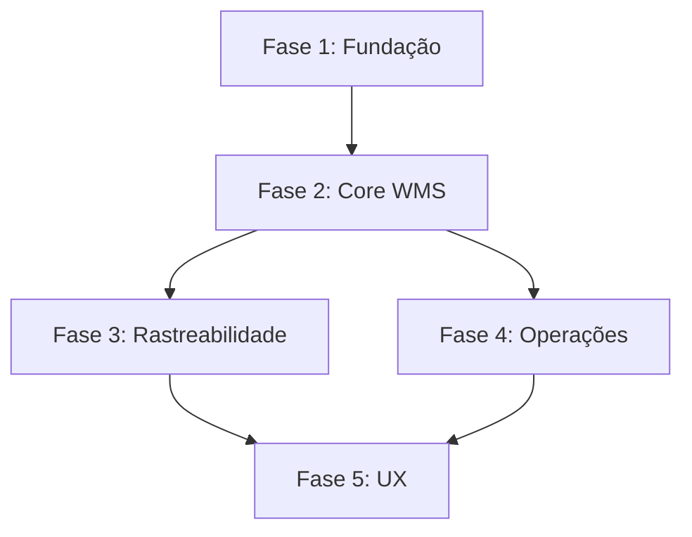

# ROADMAP DE IMPLEMENTAÇÃO - FRONTEND WMS

**Data**: 2025-11-24  
**Versão**: 1.0  
**Duração Total**: 13 semanas (3 meses)

---

## 📅 CRONOGRAMA GERAL

| Fase | Duração | Período | Status |
|------|---------|---------|--------|
| Fase 1 - Fundação | 2 semanas | Semanas 1-2 | 🔴 Não iniciado |
| Fase 2 - Módulos Core | 4 semanas | Semanas 3-6 | ⚪ Pendente |
| Fase 3 - Rastreabilidade | 2 semanas | Semanas 7-8 | ⚪ Pendente |
| Fase 4 - Operações Avançadas | 3 semanas | Semanas 9-11 | ⚪ Pendente |
| Fase 5 - UX e Otimizações | 2 semanas | Semanas 12-13 | ⚪ Pendente |

---

## 🎯 FASE 1: FUNDAÇÃO (Semanas 1-2)

**Objetivo**: Criar base sólida de componentes reutilizáveis e corrigir problemas críticos

### Semana 1

#### Dia 1-2: Sistema de Componentes Base
- [ ] **Modal genérico reutilizável** (6h)
  - Criar `shared/components/modal`
  - Implementar service de gerenciamento
  - Testes básicos
  
- [ ] **Formulário base com validação** (4h)
  - Padrões de validação
  - Mensagens de erro
  - Helper de FormGroup

#### Dia 3-4: Componentes de Input
- [ ] **Autocomplete component** (8h)
  - Busca assíncrona
  - Multi-seleção
  - Template customizável
  - Lazy loading
  
- [ ] **Input de data** (2h)
  - Calendário
  - Range de datas
  
- [ ] **Input de número** (2h)
  - Formatação
  - Min/Max
  - Step

#### Dia 5: Tabela e Utilitários
- [ ] **Tabela com paginação** (6h)
  - Ordenação
  - Filtros
  - Seleção múltipla
  
- [ ] **Pipes customizados** (2h)
  - Format currency BRL
  - Format date PT-BR
  - Format document (CPF/CNPJ)

### Semana 2

#### Dia 1-3: Corrigir Models Existentes
- [ ] **Products** (4h)
  - Adicionar TODOS campos WMS
  - Criar DTOs corretos
  - Interface completa alinhada com backend
  
- [ ] **Orders** (6h)
  - Corrigir enums (OrderType, OrderStatus, etc.)
  - Adicionar OrderItem correto
  - Criar CreateOrderRequest correto
  
- [ ] **Vehicles** (2h)
  - Corrigir plateNumber vs licensePlate
  - Adicionar campos faltantes
  
- [ ] **Inventory** (2h)
  - Model completo
  - DTOs para ajustes

#### Dia 4-5: CRUD Completo - Products
- [ ] **Product Create Modal** (6h)
  - Formulário completo
  - Todas validações
  - Upload de imagem (se aplicável)
  
- [ ] **Product Edit Modal** (4h)
  - Pré-carregar dados
  - Validações
  
- [ ] **Product Detail** (4h)
  - Visualização completa
  - Ações (editar, deletar)

**Entregáveis Fase 1**:
- ✅ Sistema de componentes compartilhados funcionando
- ✅ Products com CRUD 100% funcional
- ✅ Models corrigidos e alinhados com backend
- ✅ Padrões de código estabelecidos

---

## 🏗️ FASE 2: MÓDULOS CORE WMS (Semanas 3-6)

**Objetivo**: Implementar módulos essenciais do WMS

### Semana 3: Gestão de Usuários e Empresas

#### Dia 1-3: Users Module
- [ ] **Users Service** (2h)
  - Todos endpoints
  - DTOs
  
- [ ] **Users List** (4h)
  - Listagem
  - Filtros por role
  - Ações (editar, desativar)
  
- [ ] **User Create Modal** (4h)
  - Formulário
  - Validações (email único, senha forte)
  - Seleção de role
  
- [ ] **User Edit Modal** (3h)
  - Edição de dados
  - Change password
  - Alterar role

#### Dia 4-5: Companies Module
- [ ] **Companies Service** (2h)
- [ ] **Companies List** (3h)
- [ ] **Company Create/Edit Modals** (6h)
  - Validação CNPJ
  - Dados completos

### Semana 4: Armazéns e Estrutura

#### Dia 1-2: Warehouses (Completar)
- [ ] **Warehouse Create Modal** (4h)
- [ ] **Warehouse Edit Modal** (3h)
- [ ] **Warehouse Detail** (4h)
  - Mostrar zonas
  - Mostrar localizações
  - KPIs básicos

#### Dia 3-4: Warehouse Zones
- [ ] **Zones Service** (2h)
- [ ] **Zones List** (dentro de Warehouse Detail) (4h)
- [ ] **Zone Create/Edit Modals** (6h)
  - Tipos de zona
  - Capacidade
  - Temperatura/Umidade (se refrigerado)

#### Dia 5: Storage Locations - Parte 1
- [ ] **Locations Service** (2h)
- [ ] **Locations Model** (2h)
- [ ] **Locations List** (4h)
  - Grid visual do armazém
  - Filtros por zona
  - Status (vazia, ocupada, bloqueada)

### Semana 5: Storage Locations - Parte 2 e Customers/Suppliers

#### Dia 1-2: Storage Locations (continuação)
- [ ] **Location Create Modal** (4h)
  - Estrutura (Aisle-Rack-Level-Position)
  - Tipo de localização
  - Capacidade
  
- [ ] **Bulk Location Create** (6h)
  - Gerar múltiplas localizações
  - Preview antes de criar
  - Validações
  
- [ ] **Block/Unblock Location** (2h)

#### Dia 3: Customers (Completar)
- [ ] **Customer Create Modal** (3h)
  - Validação CPF/CNPJ
  - Todos campos
  
- [ ] **Customer Edit Modal** (2h)

#### Dia 4: Suppliers (Completar)
- [ ] **Supplier Create Modal** (3h)
- [ ] **Supplier Edit Modal** (2h)
- [ ] **Corrigir paginação** (2h)

#### Dia 5: Vehicles e Drivers (Completar)
- [ ] **Vehicle Create/Edit** (4h)
- [ ] **Driver Create/Edit** (4h)

### Semana 6: Fluxo Inbound - Parte 1

#### Dia 1-2: Orders (Completar)
- [ ] **Order Create Modal** (8h)
  - Tipo Inbound/Outbound
  - Seleção Customer/Supplier
  - Adicionar items
  - Autocomplete de produtos
  - Cálculo de totais
  
- [ ] **Order Detail** (4h)
  - Visualizar items
  - Status workflow

#### Dia 3-4: Inbound Shipments
- [ ] **InboundShipments Service** (2h)
- [ ] **InboundShipments List** (4h)
- [ ] **InboundShipment Create Modal** (4h)
  - Link com Order
  - Veículo e motorista
  - Data esperada
  
- [ ] **Receive/Complete actions** (2h)

#### Dia 5: Receipts
- [ ] **Receipts Service** (2h)
- [ ] **Receipt Create Modal** (6h)
  - Conferir items
  - Quantidade esperada vs recebida
  - Lotes (se aplicável)

**Entregáveis Fase 2**:
- ✅ Gestão completa de Usuários
- ✅ Gestão completa de Empresas
- ✅ Estrutura de Armazéns (Warehouses, Zones, Locations)
- ✅ CRUD completo: Customers, Suppliers, Vehicles, Drivers
- ✅ Orders com criação de items
- ✅ Início do fluxo Inbound (InboundShipments, Receipts)

---

## 🔄 FASE 3: RASTREABILIDADE (Semanas 7-8)

**Objetivo**: Implementar rastreamento de lotes, séries e movimentações

### Semana 7

#### Dia 1-2: Putaway Tasks
- [ ] **PutawayTasks Service** (2h)
- [ ] **PutawayTasks List** (4h)
  - Para operadores
  - Status e filtros
  
- [ ] **PutawayTask Create** (4h)
  - Sugestão de localização
  - Assign to user
  
- [ ] **PutawayTask Execute** (4h)
  - Interface para operador
  - Escanear produto
  - Escanear localização
  - Completar

#### Dia 3-4: Lots (Lotes)
- [ ] **Lots Service** (2h)
- [ ] **Lots List** (4h)
  - Por produto
  - Status e validade
  
- [ ] **Lot Create** (3h)
  - No recebimento
  - Validade
  
- [ ] **Lot Detail** (3h)
  - Rastreabilidade
  - Movimentações
  - Alertas de vencimento

#### Dia 5: Serial Numbers
- [ ] **SerialNumbers Service** (2h)
- [ ] **SerialNumbers List** (3h)
- [ ] **SerialNumber Register** (3h)
  - No recebimento
  - Bulk register

### Semana 8

#### Dia 1-3: Stock Movements
- [ ] **StockMovements Service** (2h)
- [ ] **StockMovements List** (6h)
  - Timeline view
  - Filtros avançados
  - Exportação
  
- [ ] **Movement Detail** (2h)
  - Trace completo
  
- [ ] **Manual Adjustment** (4h)
  - Criar ajuste manual
  - Motivo obrigatório
  - Aprovação

#### Dia 4-5: Cycle Counts
- [ ] **CycleCounts Service** (2h)
- [ ] **CycleCounts List** (3h)
- [ ] **CycleCount Create** (4h)
  - Selecionar produtos/zonas
  - Agendar
  
- [ ] **CycleCount Execute** (5h)
  - Interface para contagem
  - Comparar físico vs sistema
  - Gerar ajustes

**Entregáveis Fase 3**:
- ✅ Putaway Tasks funcionando
- ✅ Gestão de Lotes com FEFO
- ✅ Rastreamento por Serial Number
- ✅ Stock Movements completo
- ✅ Contagem Cíclica

---

## 📦 FASE 4: OPERAÇÕES AVANÇADAS (Semanas 9-11)

**Objetivo**: Completar fluxos Outbound e gestão de pátio

### Semana 9: Picking

#### Dia 1-2: Picking Waves
- [ ] **PickingWaves Service** (2h)
- [ ] **PickingWaves List** (4h)
- [ ] **PickingWave Create** (6h)
  - Selecionar orders
  - Estratégia (Discrete, Batch, Wave, Zone)
  - Release wave

#### Dia 3-4: Picking Tasks
- [ ] **Completar PickingTasksController backend** (4h)
  - Se necessário
  
- [ ] **PickingTasks Service** (2h)
- [ ] **PickingTasks List** (4h)
  - Por wave
  - Para operadores
  
- [ ] **PickingTask Execute** (4h)
  - Interface operador
  - Escanear localização
  - Escanear produto
  - Confirmar quantidade

#### Dia 5: Integração Picking
- [ ] **Wave monitoring dashboard** (4h)
- [ ] **Wave complete workflow** (4h)

### Semana 10: Packing e Expedição

#### Dia 1-2: Packing Tasks
- [ ] **PackingTasks Service** (2h)
- [ ] **PackingTasks List** (3h)
- [ ] **PackingTask Execute** (6h)
  - Interface embalar
  - Gerar packages
  - Dimensões e peso

#### Dia 3: Packages
- [ ] **Packages Service** (2h)
- [ ] **Packages List** (3h)
- [ ] **Package Create/Edit** (3h)
  - Tracking number
  - Dimensões

#### Dia 4-5: Outbound Shipments
- [ ] **OutboundShipments Service** (2h)
- [ ] **OutboundShipments List** (3h)
- [ ] **OutboundShipment Create** (4h)
  - Agrupar packages
  - Veículo
  
- [ ] **Ship action** (3h)
  - Documentos
  - Check-out

### Semana 11: Gestão de Pátio

#### Dia 1-3: Vehicle Appointments
- [ ] **VehicleAppointments Service** (2h)
- [ ] **Appointments Calendar View** (6h)
  - Calendário visual
  - Drag and drop
  
- [ ] **Appointment Create** (4h)
  - Tipo Inbound/Outbound
  - Veículo e motorista
  - Porta de docagem

#### Dia 4-5: Dock Doors e Portaria
- [ ] **DockDoors Service** (2h)
- [ ] **DockDoors Management** (3h)
- [ ] **Check-in/Check-out Interface** (6h)
  - Portaria
  - Tempo de permanência
  - Alertas

**Entregáveis Fase 4**:
- ✅ Fluxo Outbound completo (Picking → Packing → Shipping)
- ✅ Gestão de pátio e agendamentos
- ✅ Sistema completo Inbound + Outbound funcionando

---

## 🎨 FASE 5: UX E OTIMIZAÇÕES (Semanas 12-13)

**Objetivo**: Melhorar experiência do usuário e performance

### Semana 12: UX Improvements

#### Dia 1-2: Filtros e Pesquisa
- [ ] **Filtros avançados em todas listas** (8h)
  - Multi-select
  - Range de datas
  - Quick filters
  - Salvar filtros

#### Dia 3: Exportação
- [ ] **Export para Excel/CSV** (6h)
  - Todas as listas principais
  - Respeitar filtros

#### Dia 4-5: Workflows Visuais
- [ ] **Order workflow visual** (4h)
  - Timeline
  - Status atual
  
- [ ] **Shipment tracking** (4h)
  - Visual tracking
  - Histórico

### Semana 13: Dashboard e Performance

#### Dia 1-2: Dashboard Principal
- [ ] **Dashboard com KPIs** (8h)
  - Orders em andamento
  - Estoque crítico
  - Tarefas pendentes
  - Performance warehouse
  - Gráficos
  
- [ ] **Widgets customizáveis** (4h)

#### Dia 3: Performance
- [ ] **Lazy loading** (3h)
  - Virtual scroll em listas grandes
  
- [ ] **Cache de dados** (3h)
  - Storage service
  - Refresh strategy

#### Dia 4-5: Testes e Ajustes
- [ ] **Testes E2E principais fluxos** (6h)
- [ ] **Correções de bugs** (6h)
- [ ] **Documentação de uso** (2h)

**Entregáveis Fase 5**:
- ✅ UX profissional e consistente
- ✅ Dashboard completo com KPIs
- ✅ Performance otimizada
- ✅ Sistema completo e testado

---

## 📊 MÉTRICAS DE PROGRESSO

### Por Fase

| Fase | Módulos | Componentes | Serviços | Progresso |
|------|---------|-------------|----------|-----------|
| Fase 1 | 1 | 8 | 1 | 0% |
| Fase 2 | 8 | 35 | 8 | 0% |
| Fase 3 | 5 | 20 | 5 | 0% |
| Fase 4 | 6 | 25 | 6 | 0% |
| Fase 5 | Dashboard | 10 | - | 0% |
| **Total** | **20** | **98** | **20** | **0%** |

### Endpoints Consumidos

| Categoria | Total | Implementados | Progresso |
|-----------|-------|---------------|-----------|
| Auth | 2 | 2 | 100% |
| Core (Users, Companies) | 12 | 0 | 0% |
| Cadastros (Products, etc) | 35 | 15 | 43% |
| WMS Inbound | 25 | 2 | 8% |
| WMS Outbound | 30 | 0 | 0% |
| Inventário | 20 | 3 | 15% |
| Pátio | 10 | 0 | 0% |
| **Total** | **134** | **22** | **16%** |

---

## 🎯 DEPENDÊNCIAS ENTRE FASES

**Bloqueadores**:
- Fase 2 depende completamente da Fase 1
- Fase 3 precisa de Storage Locations (Fase 2)
- Fase 4 precisa de Inventário funcional (Fase 2+3)
- Fase 5 pode começar em paralelo com Fase 4 (semana 11)

---

## ⚠️ RISCOS E MITIGAÇÕES

| Risco | Probabilidade | Impacto | Mitigação |
|-------|---------------|---------|-----------|
| PickingTasksController backend vazio | Alta | Alto | Implementar backend primeiro (1-2 dias) |
| Complexidade dos fluxos WMS | Média | Alto | Estudar documentação, testes extensivos |
| Performance com muitos dados | Média | Médio | Virtual scroll, paginação, lazy loading |
| Integração com backend | Baixa | Alto | Seguir DTOs documentados rigorosamente |
| Mudanças de requisitos | Média | Médio | Roadmap flexível, sprints de 1 semana |

---

## 📝 CHECKLIST ANTES DE CADA FASE

### Antes de iniciar Fase 1:
- [ ] Aprovação do roadmap
- [ ] Time definido
- [ ] Ambiente de desenvolvimento configurado
- [ ] Acesso ao backend funcionando

### Antes de iniciar Fase 2:
- [ ] Fase 1 100% completa
- [ ] Code review da Fase 1
- [ ] Padrões de código documentados
- [ ] Componentes base testados

### Antes de iniciar Fase 3:
- [ ] Storage Locations funcionando
- [ ] Fluxo básico Inbound testado
- [ ] Backend PickingTasks implementado (se necessário)

### Antes de iniciar Fase 4:
- [ ] Rastreabilidade funcionando
- [ ] Lotes e movimentações testados
- [ ] Equipe treinada nos fluxos WMS

### Antes de iniciar Fase 5:
- [ ] Todos fluxos críticos funcionando
- [ ] Testes de integração passando
- [ ] Aprovação do cliente para melhorias de UX

---

## 🚀 QUICK WINS (Entregas Rápidas)

Itens que podem ser entregues rapidamente para mostrar progresso:

**Semana 1**:
- ✅ Modal genérico funcionando
- ✅ Product Create Modal

**Semana 2**:
- ✅ Products CRUD 100%
- ✅ Models corrigidos

**Semana 4**:
- ✅ Users management
- ✅ Warehouse Zones

**Semana 6**:
- ✅ Order creation com items
- ✅ Inbound Shipment básico

---

## 📈 CRITÉRIOS DE SUCESSO

### Por Fase

**Fase 1**: 
- ✅ Criar produto sem erros
- ✅ Editar produto sem erros
- ✅ Todos fields salvando corretamente

**Fase 2**:
- ✅ Fluxo Inbound básico funciona end-to-end
- ✅ Storage Locations criadas e funcionais
- ✅ Multi-tenancy funcionando

**Fase 3**:
- ✅ Lote rastreável do recebimento até expedição
- ✅ Ajustes de estoque com auditoria
- ✅ Contagem cíclica completa

**Fase 4**:
- ✅ Fluxo Outbound completo funciona
- ✅ Picking Wave processada com sucesso
- ✅ Agendamento e check-in de veículos

**Fase 5**:
- ✅ Dashboard com dados reais
- ✅ Performance aceitável (< 2s para carregar listas)
- ✅ Testes E2E passando

---

## 🎓 TREINAMENTO NECESSÁRIO

- **Equipe Frontend**: 
  - Angular Signals (2h)
  - Reactive Forms (3h)
  - RxJS básico (2h)
  - Conceitos WMS (4h)

- **Equipe Teste**:
  - Fluxos WMS (6h)
  - Cypress E2E (4h)

---

**PRÓXIMO PASSO**: Começar Fase 1 - Dia 1
