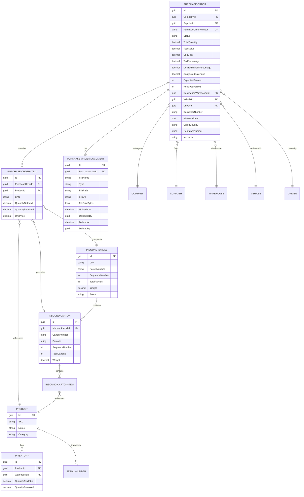

# 📦 DIAGRAMA COMPLETO: PURCHASE ORDERS (COMPRAS)

**Data**: 2025-11-27  
**Versão**: 1.0

---

## 🎯 FLUXO COMPLETO DE COMPRAS

```mermaid
flowchart TD
    Start([Iniciar Purchase Order]) --> CheckSupplier{Fornecedor<br/>cadastrado?}
    
    CheckSupplier -->|Não| CreateSupplier[Cadastrar Fornecedor<br/>- Nome<br/>- CNPJ<br/>- Contato<br/>- Endereço]
    CreateSupplier --> SelectSupplier
    CheckSupplier -->|Sim| SelectSupplier[Selecionar Fornecedor]
    
    SelectSupplier --> CreatePO[Criar Purchase Order<br/>PO-2025-XXX]
    
    CreatePO --> AddProducts{Adicionar<br/>Produtos}
    
    AddProducts --> CheckProduct{Produto<br/>cadastrado?}
    CheckProduct -->|Não| CreateProduct[Cadastrar Produto<br/>- SKU<br/>- Nome<br/>- Categoria]
    CreateProduct --> SelectProduct
    CheckProduct -->|Sim| SelectProduct[Selecionar Produto]
    
    SelectProduct --> DefineQty[Definir Quantidades<br/>- Qty Ordenada<br/>- Unit Cost<br/>- Total Value]
    
    DefineQty --> MoreProducts{Mais<br/>produtos?}
    MoreProducts -->|Sim| AddProducts
    MoreProducts -->|Não| SetPrices
    
    SetPrices[Definir Preços/Margens<br/>- Unit Cost<br/>- Tax %<br/>- Desired Margin %<br/>→ Suggested Sale Price]
    
    SetPrices --> SetHierarchy[Definir Hierarquia<br/>- Expected Parcels<br/>- Cartons per Parcel<br/>- Units per Carton<br/>Validação: P×C×U = Total]
    
    SetHierarchy --> CheckInternational{Compra<br/>Internacional?}
    
    CheckInternational -->|Sim| SetInternational[Definir Dados Importação<br/>- Origin Country<br/>- Port of Entry<br/>- Container Number<br/>- Incoterm FOB/CIF<br/>- Bill of Lading<br/>- Import License]
    
    CheckInternational -->|Não| SetLogistics
    SetInternational --> SetLogistics
    
    SetLogistics[Definir Logística<br/>- Destination Warehouse<br/>- Vehicle<br/>- Driver<br/>- Dock Door<br/>- Shipping Distance<br/>- Shipping Cost]
    
    SetLogistics --> UploadDocs[Upload Documentos<br/>- Invoice.webp<br/>- DI.webp<br/>- BL.webp<br/>- Packing List.webp<br/>- Certificates.webp]
    
    UploadDocs --> GeneratePrint[Gerar/Imprimir PO<br/>PDF A4<br/>Todas as informações]
    
    GeneratePrint --> POCreated[Purchase Order Criado<br/>Status: Draft/Pending]
    
    POCreated --> WaitArrival{Aguardar<br/>Chegada}
    
    WaitArrival -->|Chegou| StartReceiving[Iniciar Recebimento<br/>Scan LPN Pallet]
    
    StartReceiving --> ScanCarton[Scan Carton<br/>EAN-128/Barcode]
    
    ScanCarton --> ScanProduct[Scan Produto<br/>Serial Number opcional]
    
    ScanProduct --> UpdateQty[Atualizar Qty Received<br/>em PurchaseOrderItem]
    
    UpdateQty --> MoreCartons{Mais<br/>caixas?}
    MoreCartons -->|Sim| ScanCarton
    MoreCartons -->|Não| CompletePallet
    
    CompletePallet[Completar Pallet<br/>Increment ReceivedParcels]
    
    CompletePallet --> MorePallets{Mais<br/>pallets?}
    MorePallets -->|Sim| StartReceiving
    MorePallets -->|Não| UpdateInventory
    
    UpdateInventory[Atualizar Inventory<br/>QuantityAvailable += Received<br/>Por Produto]
    
    UpdateInventory --> CompletePO[Purchase Order Completo<br/>Status: Completed]
    
    CompletePO --> End([Fim])
    
    style Start fill:#4CAF50,color:#fff
    style End fill:#4CAF50,color:#fff
    style CreatePO fill:#2196F3,color:#fff
    style SetInternational fill:#FF9800,color:#fff
    style UploadDocs fill:#9C27B0,color:#fff
    style CompletePO fill:#4CAF50,color:#fff
```



---

## 🗄️ ENTIDADES RELACIONADAS



---

## 📋 DETALHAMENTO POR ETAPA

### 1️⃣ CADASTRO INICIAL

**Entidades envolvidas**:
- `Company` (empresa que está comprando)
- `Supplier` (fornecedor)
- `Product` (produtos a comprar)

**Campos obrigatórios**:
```
Supplier:
- Name
- CNPJ/Tax ID
- Email
- Phone
- Address

Product:
- SKU (único)
- Name
- Category
- Unit of Measure
```

---

### 2️⃣ CRIAÇÃO PURCHASE ORDER

**Endpoint**: `POST /api/purchase-orders`

**Request**:
```json
{
  "companyId": "guid",
  "purchaseOrderNumber": "PO-2025-001",
  "supplierId": "guid-dell",
  "expectedDate": "2025-12-15",
  "priority": "High",
  "items": [
    {
      "productId": "guid-computador",
      "sku": "COMP-DELL-001",
      "quantityOrdered": 5000,
      "unitPrice": 2500.00
    },
    {
      "productId": "guid-mouse",
      "sku": "MOUSE-LOG-01",
      "quantityOrdered": 500,
      "unitPrice": 150.00
    }
  ]
}
```

**Validações**:
- ✅ Company existe
- ✅ Supplier existe
- ✅ PurchaseOrderNumber único
- ✅ Todos os produtos existem
- ✅ Quantidades > 0

---

### 3️⃣ PREÇOS E MARGENS

**Endpoint**: `POST /api/purchase-orders/{id}/purchase-details`

**Request**:
```json
{
  "unitCost": 2500.00,
  "taxPercentage": 18.0,
  "desiredMarginPercentage": 30.0
}
```

**Cálculo automático**:
```
Cost with Tax = 2500 × 1.18 = 2950.00
Suggested Sale Price = 2950 × 1.30 = 3835.00
Estimated Profit = (3835 - 2950) × 5000 = 4.425.000,00
```

---

### 4️⃣ HIERARQUIA DE EMBALAGEM

**Endpoint**: `POST /api/purchase-orders/{id}/packaging-hierarchy`

**Request**:
```json
{
  "expectedParcels": 10,
  "cartonsPerParcel": 10,
  "unitsPerCarton": 50
}
```

**Validação**:
```
10 parcels × 10 cartons × 50 units = 5.000 units
✅ Bate com TotalQuantity
```

---

### 5️⃣ DADOS INTERNACIONAIS (SE APLICÁVEL)

**Endpoint**: `POST /api/purchase-orders/{id}/set-international`

**Request**:
```json
{
  "originCountry": "China",
  "portOfEntry": "Santos/SP",
  "containerNumber": "MSCU1234567",
  "incoterm": "FOB"
}
```

**Campos opcionais adicionais**:
- Bill of Lading (BL)
- Import License Number (LI)
- Customs Broker
- Estimated Arrival Port

---

### 6️⃣ LOGÍSTICA

**Endpoint**: `POST /api/purchase-orders/{id}/set-logistics`

**Request**:
```json
{
  "destinationWarehouseId": "guid-warehouse-sp",
  "vehicleId": "guid-truck-abc1234",
  "driverId": "guid-driver-joao",
  "dockDoorNumber": "DOCK-01",
  "shippingDistance": "850 km",
  "shippingCost": 2500.00
}
```

---

### 7️⃣ UPLOAD DE DOCUMENTOS

**Endpoint**: `POST /api/purchase-orders/{id}/documents`

**Documentos suportados**:
- Invoice (Nota Fiscal)
- DI (Declaração de Importação)
- BL (Bill of Lading)
- Packing List
- Certificates
- Other

**Request** (multipart/form-data):
```
file: invoice.jpg
type: Invoice
```

**Backend processa**:
- Converte JPG/PNG → WebP
- Salva em `/uploads/purchase-orders/{id}/`
- Gera FileUrl acessível
- Máximo 10MB por arquivo

---

### 8️⃣ IMPRESSÃO

**Endpoint**: `GET /api/purchase-orders/{id}/print`

**Retorna**: PDF A4 com:
- Logo da empresa
- Dados do fornecedor
- Lista de produtos (tabela)
- Hierarquia de embalagem
- Dados internacionais (se aplicável)
- Dados logísticos
- Total values

---

### 9️⃣ RECEBIMENTO

**Entidades criadas**:

1. **InboundShipment** (ASN - Advanced Shipping Notice)
   - Linked to PurchaseOrder
   - Total expected parcels

2. **InboundParcel** (Pallet/Volume)
   - LPN (License Plate Number) - SSCC
   - Sequence 1 of 10
   - Weight
   - Status: Pending → Receiving → Received

3. **InboundCarton** (Caixa)
   - Barcode (EAN-128)
   - Sequence 1 of 10
   - Weight, dimensions
   - Status: Pending → Received

4. **InboundCartonItem** (Produto dentro da caixa)
   - ProductId
   - Quantity
   - Serial Number (opcional)

**Fluxo**:
```
Scan LPN → Cria InboundParcel
↓
Scan Carton Barcode → Cria InboundCarton
↓
Scan Product/Serial → Cria InboundCartonItem
↓
Complete Parcel → Increment PurchaseOrder.ReceivedParcels
↓
Update PurchaseOrderItem.QuantityReceived
↓
Update Inventory.QuantityAvailable
```

---

### 🔟 ATUALIZAÇÃO DE ESTOQUE

**Endpoint**: Automático no recebimento

**Lógica**:
```sql
-- Para cada produto recebido
UPDATE Inventory
SET QuantityAvailable = QuantityAvailable + QuantityReceived
WHERE ProductId = '{productId}' AND WarehouseId = '{warehouseId}';

-- Se não existe, cria
INSERT INTO Inventory (ProductId, WarehouseId, QuantityAvailable)
VALUES ('{productId}', '{warehouseId}', {quantityReceived});
```

---

## 📊 DASHBOARD DE RECEBIMENTO

**Indicadores**:
- Total PO Value
- Expected vs Received Parcels (10/10)
- Expected vs Received Quantity (5000/4850)
- % Progress (97%)
- Pending items
- Damaged items

**Visualização**:
```
Purchase Order: PO-2025-001
Supplier: Dell Inc.
Total Value: R$ 12.500.000,00

Progress:
[========== ] 10/10 Parcels (100%)
[========== ] 5000/5000 Units (100%)

Products:
✅ Notebook Dell - 5000/5000 received
✅ Mouse Logitech - 500/500 received
```

---

## 🎯 RESUMO ENTIDADES VINCULADAS

| Entidade | Relação | Obrigatório |
|----------|---------|-------------|
| **Company** | 1:N | ✅ Sim |
| **Supplier** | 1:N | ✅ Sim |
| **Product** | N:M (via Items) | ✅ Sim |
| **PurchaseOrderItem** | 1:N | ✅ Sim |
| **PurchaseOrderDocument** | 1:N | ❌ Não |
| **Warehouse** | N:1 (destination) | ✅ Sim |
| **Vehicle** | N:1 | ❌ Não |
| **Driver** | N:1 | ❌ Não |
| **InboundShipment** | 1:1 | ✅ Sim (no recebimento) |
| **InboundParcel** | 1:N | ✅ Sim (no recebimento) |
| **InboundCarton** | 1:N | ✅ Sim (no recebimento) |
| **InboundCartonItem** | 1:N | ✅ Sim (no recebimento) |
| **Inventory** | N:1 (per product/warehouse) | ✅ Sim (atualizado) |
| **SerialNumber** | 1:N (se rastreável) | ❌ Não |

---

## 🔄 STATUS DO PURCHASE ORDER

```
Draft → Pending → Confirmed → Receiving → Completed
  ↓       ↓          ↓            ↓           ↓
Editável | Aguarda | Aprovado | Em processo | Finalizado
         | aprovação|          | recebimento | Estoque OK
```

---

**Total de tabelas envolvidas**: 15+  
**Total de campos**: 100+  
**Endpoints**: 10+
