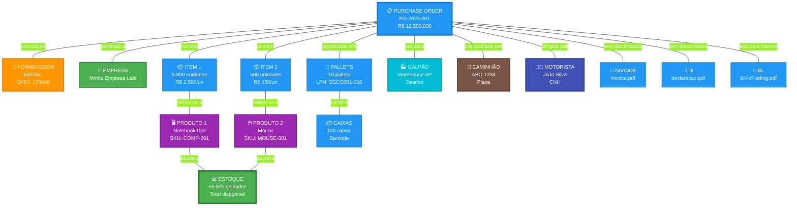

# 📦 DIAGRAMA VISUAL: FLUXO DE COMPRAS (PURCHASE ORDERS)

**Para pessoas leigas** - Versão simplificada e visual

---

## 🎯 FLUXO PRINCIPAL (PASSO A PASSO)

```mermaid
%%{init: {'theme':'base', 'themeVariables': { 'primaryColor':'#4CAF50','primaryTextColor':'#fff','primaryBorderColor':'#2E7D32','lineColor':'#1976D2','secondaryColor':'#2196F3','tertiaryColor':'#FFC107'}}}%%
flowchart LR
    A[👤 Fornecedor<br/>Dell, HP, etc] -->|Vou comprar de| B[📝 Criar<br/>Purchase Order<br/>PO-2025-001]
    
    B --> C[🏷️ Selecionar<br/>Categoria<br/>Computadores]
    
    C --> D[🖥️ Adicionar<br/>Produtos<br/>5.000 notebooks]
    
    D --> E[💰 Definir<br/>Preços<br/>R$ 2.500 cada]
    
    E --> F[📦 Hierarquia<br/>10 pallets<br/>10 caixas<br/>50 unidades]
    E --> F{🌍 É<br/>Importação?}
    
    F -->|Sim| G[✈️ Dados<br/>Internacionais<br/>Container, Porto]
    F -->|Não| H
    
    G --> H[🚚 Logística<br/>Caminhão, Motorista<br/>Galpão destino]
    
    H --> I[📄 Upload<br/>Documentos<br/>Invoice, DI, BL]
    
    I --> J[🖨️ Imprimir<br/>Purchase Order]
    
    J --> K[⏳ Aguardar<br/>Chegada]
    
    K --> L[📥 Recebimento<br/>Scan pallets<br/>Scan caixas]
    
    L --> M[📊 Atualizar<br/>Estoque<br/>+5.000 notebooks]
    
    M --> N[✅ Completo]
    
    style A fill:#FF9800,stroke:#F57C00,stroke-width:3px,color:#fff
    style B fill:#2196F3,stroke:#1976D2,stroke-width:3px,color:#fff
    style C fill:#9C27B0,stroke:#7B1FA2,stroke-width:3px,color:#fff
    style D fill:#4CAF50,stroke:#388E3C,stroke-width:3px,color:#fff
    style E fill:#00BCD4,stroke:#0097A7,stroke-width:3px,color:#fff
    style F fill:#FFC107,stroke:#FFA000,stroke-width:3px,color:#000
    style G fill:#E91E63,stroke:#C2185B,stroke-width:3px,color:#fff
    style H fill:#3F51B5,stroke:#303F9F,stroke-width:3px,color:#fff
    style I fill:#795548,stroke:#5D4037,stroke-width:3px,color:#fff
    style J fill:#607D8B,stroke:#455A64,stroke-width:3px,color:#fff
    style K fill:#FFEB3B,stroke:#FBC02D,stroke-width:2px,color:#000
    style L fill:#8BC34A,stroke:#689F38,stroke-width:3px,color:#fff
    style M fill:#CDDC39,stroke:#AFB42B,stroke-width:3px,color:#000
    style N fill:#4CAF50,stroke:#2E7D32,stroke-width:4px,color:#fff
```



---

## 🏗️ O QUE ESTÁ CONECTADO? (ENTIDADES)



---

## 📋 EXEMPLO PRÁTICO: COMPRAR 5.000 NOTEBOOKS

### 1️⃣ INÍCIO
```
🏢 Minha Empresa precisa de notebooks
↓
👤 Vou comprar da DELL
↓
📝 Criar Purchase Order: PO-2025-001
```

### 2️⃣ ADICIONAR PRODUTOS
```
🖥️ Produto: Notebook Dell Inspiron 15
   SKU: COMP-DELL-001
   Quantidade: 5.000 unidades
   Preço unitário: R$ 2.500,00
   Total: R$ 12.500.000,00
```

### 3️⃣ DEFINIR PREÇOS E MARGENS
```
💰 Custo unitário: R$ 2.500,00
📊 Impostos: 18% = R$ 450,00
💵 Custo com imposto: R$ 2.950,00
📈 Margem desejada: 30%
💲 Preço venda sugerido: R$ 3.835,00
💎 Lucro estimado: R$ 4.425.000,00
```

### 4️⃣ ORGANIZAR EMBALAGEM
```
📦 Hierarquia:
   10 pallets (parcels)
   ×
   10 caixas por pallet
   ×
   50 notebooks por caixa
   =
   5.000 notebooks TOTAL ✅
```

### 5️⃣ SE FOR IMPORTAÇÃO (INTERNACIONAL)
```
🌍 Origem: China
✈️ Porto de entrada: Santos/SP
📦 Container: MSCU1234567
🚢 Incoterm: FOB
📄 Bill of Lading: BL-2025-001
📋 Licença Importação: LI-123456
```

### 6️⃣ DEFINIR LOGÍSTICA
```
🏭 Galpão destino: Warehouse São Paulo
🚛 Caminhão: ABC-1234
👨‍✈️ Motorista: João Silva (CNH: 12345)
🚪 Dock Door: DOCK-01
📏 Distância: 850 km
💰 Custo frete: R$ 2.500,00
```

### 7️⃣ UPLOAD DOCUMENTOS
```
📄 Invoice (Nota Fiscal): invoice-dell-2025.pdf
📄 DI (Declaração Importação): di-123456.pdf
📄 BL (Bill of Lading): bl-santos-2025.pdf
📄 Packing List: packing-list.pdf
📄 Certificados: certificate-quality.pdf
```

### 8️⃣ IMPRIMIR PURCHASE ORDER
```
🖨️ Gera PDF A4:
   - Cabeçalho com logo
   - Dados do fornecedor
   - Lista de produtos (tabela)
   - Totais
   - Hierarquia de embalagem
   - Dados logísticos
```

### 9️⃣ RECEBIMENTO (QUANDO CHEGAR)
```
📥 Caminhão chegou no DOCK-01
↓
🎁 Scan pallet 1 de 10: LPN SSCC0001
↓
📦 Scan caixa 1 de 10: Barcode EAN128-001
↓
🖥️ Scan produto: Serial SN123456789
↓
✅ Registrado: 50 notebooks recebidos
↓
🔁 Repetir para todas caixas e pallets
↓
📊 Atualizar estoque: +5.000 notebooks
```

### 🔟 RESULTADO FINAL
```
✅ Purchase Order COMPLETO
📊 Estoque atualizado
🎯 5.000 notebooks disponíveis para venda
💰 Valor total investido: R$ 12.500.000,00
📈 Lucro potencial: R$ 4.425.000,00
```

---

## 🎨 TELAS DO SISTEMA (FRONTEND)

### TELA 1: Lista de Purchase Orders
```
┌─────────────────────────────────────────────────┐
│ 📦 PURCHASE ORDERS               [+ Novo PO]    │
├─────────────────────────────────────────────────┤
│                                                  │
│ 🔍 Buscar: [________________] 🔎               │
│                                                  │
│ ┌──────────────────────────────────────────┐   │
│ │ PO-2025-001 | Dell Inc. | R$ 12.500.000  │   │
│ │ Status: Recebendo [████████░░] 80%        │   │
│ │ 8/10 pallets | 4.000/5.000 unidades      │   │
│ └──────────────────────────────────────────┘   │
│                                                  │
│ ┌──────────────────────────────────────────┐   │
│ │ PO-2025-002 | HP Brasil | R$ 8.000.000   │   │
│ │ Status: Pendente                          │   │
│ │ 0/5 pallets | 0/3.000 unidades          │   │
│ └──────────────────────────────────────────┘   │
│                                                  │
└─────────────────────────────────────────────────┘
```

### TELA 2: Criar Purchase Order (WIZARD)
```
┌─────────────────────────────────────────────────┐
│ 📝 Nova Purchase Order                          │
├─────────────────────────────────────────────────┤
│ [1.Info] [2.Produtos] [3.Preços] [4.Embalagem] │
│                                                  │
│ Step 1: Informações Básicas                     │
│                                                  │
│ Fornecedor: [Dell Inc. ▼]                      │
│                                                  │
│ Número PO: [PO-2025-001]                        │
│                                                  │
│ Data esperada: [15/12/2025 📅]                 │
│                                                  │
│ Prioridade: [Alta ▼]                           │
│                                                  │
│         [Cancelar]  [Próximo →]                │
└─────────────────────────────────────────────────┘
```

### TELA 3: Adicionar Produtos
```
┌─────────────────────────────────────────────────┐
│ 📝 Nova Purchase Order - Produtos               │
├─────────────────────────────────────────────────┤
│                                                  │
│ Produto: [Notebook Dell Inspiron 15 ▼]         │
│ SKU: COMP-DELL-001                              │
│ Estoque atual: 1.000 unidades                   │
│                                                  │
│ Quantidade: [5000]                              │
│ Preço unitário: [R$ 2500,00]                    │
│ Total: R$ 12.500.000,00                         │
│                                                  │
│        [+ Adicionar Produto]                    │
│                                                  │
│ ┌────────────────────────────────────────────┐ │
│ │ PRODUTOS ADICIONADOS:                       │ │
│ │ • Notebook Dell - 5.000 un - R$ 12.500k    │ │
│ │ • Mouse Logitech - 500 un - R$ 75k         │ │
│ │ TOTAL: R$ 12.575.000,00                     │ │
│ └────────────────────────────────────────────┘ │
│                                                  │
│         [← Voltar]  [Próximo →]                │
└─────────────────────────────────────────────────┘
```

### TELA 4: Definir Hierarquia
```
┌─────────────────────────────────────────────────┐
│### Passo 5: Hierarquia de Embalagem 📦                     │
├─────────────────────────────────────────────────┤
│                                                  │
│ Expected Parcels (Pallets): [10]                │
│ Caixas por Pallet: [10]                         │
│ Unidades por Caixa: [50]                        │
│                                                  │
│ ┌────────────────────────────────────────────┐ │
│ │ CÁLCULO AUTOMÁTICO:                         │ │
│ │                                              │ │
│ │ 10 pallets × 10 caixas × 50 unidades       │ │
│ │ = 5.000 unidades                            │ │
│ │                                              │ │
│ │ ✅ Bate com quantidade total!               │ │
│ └────────────────────────────────────────────┘ │
│                                                  │
│         [← Voltar]  [Próximo →]                │
└─────────────────────────────────────────────────┘
```

### TELA 5: Dashboard de Recebimento
```
┌─────────────────────────────────────────────────┐
│ 📥 Recebimento - PO-2025-001                    │
├─────────────────────────────────────────────────┤
│                                                  │
│ Progresso Geral:                                │
│ [████████████████████] 100% Completo            │
│                                                  │
│ Pallets: 10/10 ✅                               │
│ [██████████] 100%                               │
│                                                  │
│ Unidades: 5.000/5.000 ✅                        │
│ [██████████] 100%                               │
│                                                  │
│ ┌────────────────────────────────────────────┐ │
│ │ PRODUTOS RECEBIDOS:                         │ │
│ │ ✅ Notebook Dell: 5.000/5.000               │ │
│ │ ✅ Mouse Logitech: 500/500                  │ │
│ └────────────────────────────────────────────┘ │
│                                                  │
│ ┌────────────────────────────────────────────┐ │
│ │ ÚLTIMO SCAN:                                │ │
│ │ 🎁 Pallet 10 - LPN: SSCC0010               │ │
│ │ 📦 Caixa 10 - Barcode: EAN128-100          │ │
│ │ 🖥️ Produto: SN987654321                    │ │
│ │ ⏰ 27/11/2025 20:15                         │ │
│ └────────────────────────────────────────────┘ │
│                                                  │
│         [Imprimir Relatório]  [Fechar]         │
└─────────────────────────────────────────────────┘
```

---

## 📊 ESTOQUE ANTES E DEPOIS

### ANTES DA COMPRA
```
┌─────────────────────────────┐
│ 📊 ESTOQUE                  │
├─────────────────────────────┤
│ Notebook Dell:              │
│ ▓▓░░░░░░░░ 1.000 unidades   │
│                             │
│ ⚠️ ESTOQUE BAIXO            │
└─────────────────────────────┘
```

### DEPOIS DA COMPRA (RECEBIMENTO)
```
┌─────────────────────────────┐
│ 📊 ESTOQUE                  │
├─────────────────────────────┤
│ Notebook Dell:              │
│ ▓▓▓▓▓▓▓▓▓▓ 6.000 unidades   │
│ (+5.000 recebidos)          │
│                             │
│ ✅ ESTOQUE OK               │
└─────────────────────────────┘
```

---

## 🎯 RESUMO PARA LEIGOS

**Purchase Order (Pedido de Compra) é como uma "lista de compras gigante" para empresas**

1. **Você escolhe** de quem vai comprar
### Passo 6: Dados Internacionais 🌍Categoria 🏷️

- Escolher categoria de produtos (Ex: Computadores, Ferramentas, Manutenção)
- Categoria filtra apenas produtos relevantes
- Facilita localização e organização

### Passo 4: Definir Preços e Margens 💰📦

- Adicionar produtos da categoria escolhida
- Informar quantidade de cada produto
- Definir preço unitários e calcula lucro futuro
4. **Organiza** como vai chegar (pallets, caixas)
5. **Se for de fora do país**, adiciona dados de importação
6. **Define logística**: caminhão, motorista, galpão
7. **Anexa documentos** importantes
8. **Imprime** tudo
9. **Quando chegar**, faz o recebimento escaneando tudo
10. **Atualiza o estoque** automaticamente

**Tudo conectado**: Fornecedor → Produtos → Estoque → Galpão → Caminhão → Motorista → Documentos

**Resultado**: Você sempre sabe **o que comprou**, **de quem**, **quanto pagou**, **onde está** e **quando vai chegar**!
