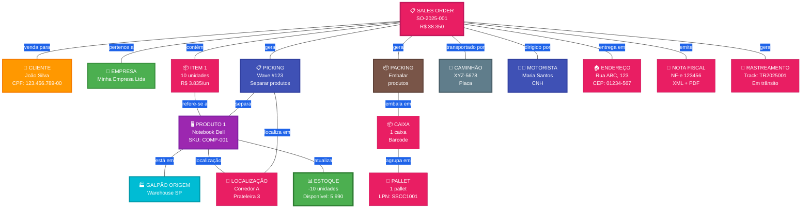

# 🚚 DIAGRAMA VISUAL: FLUXO DE VENDAS (SALES ORDERS)

**Para pessoas leigas** - Versão simplificada e visual

---

## 🎯 FLUXO PRINCIPAL (PASSO A PASSO)

```mermaid
%%{init: {'theme':'base', 'themeVariables': { 'primaryColor':'#4CAF50','primaryTextColor':'#fff','primaryBorderColor':'#2E7D32','lineColor':'#E91E63','secondaryColor':'#2196F3','tertiaryColor':'#FFC107'}}}%%
flowchart LR
    A[👥 Cliente<br/>João Silva] -->|Faz pedido| B[📝 Criar<br/>Sales Order<br/>SO-2025-001]
    
    B --> C[🖥️ Adicionar<br/>Produtos<br/>10 notebooks]
    
    C --> D{📦 Tem<br/>estoque?}
    
    D -->|Não| E[❌ Erro<br/>Sem estoque]
    D -->|Sim| F[🔒 Reservar<br/>Estoque<br/>10 unidades]
    
    F --> G[📦 Hierarquia<br/>1 pallet<br/>1 caixa<br/>10 unidades]
    
    G --> H{🏪 BOPIS?<br/>Retira<br/>na loja?}
    
    H -->|Sim| I[✅ Pronto<br/>para Retirada<br/>Notificar cliente]
    H -->|Não| J[🏠 Endereço<br/>Entrega<br/>CEP, Rua]
    
    I --> END
    
    J --> K[🚚 Logística<br/>Caminhão, Motorista<br/>Galpão origem]
    
    K --> L[📋 Separação<br/>PICKING<br/>Scan produtos]
    
    L --> M[📦 Embalagem<br/>PACKING<br/>Embalar caixas]
    
    M --> N[📄 Gerar<br/>Nota Fiscal<br/>PDF/XML]
    
    N --> O[🖨️ Imprimir<br/>Etiquetas<br/>Documentos]
    
    O --> P[🚛 Carregar<br/>Veículo<br/>Despachar]
    
    P --> Q[📤 Enviado<br/>Tracking Number<br/>Rastreamento]
    
    Q --> R[🚚 Em Trânsito<br/>Cliente acompanha]
    
    R --> S[📍 Entregue<br/>Cliente recebeu]
    
    S --> T[📊 Atualizar<br/>Estoque<br/>-10 notebooks]
    
    T --> U[✅ Completo]
    
    style A fill:#E91E63,stroke:#C2185B,stroke-width:3px,color:#fff
    style B fill:#2196F3,stroke:#1976D2,stroke-width:3px,color:#fff
    style C fill:#9C27B0,stroke:#7B1FA2,stroke-width:3px,color:#fff
    style D fill:#FFC107,stroke:#FFA000,stroke-width:3px,color:#000
    style E fill:#F44336,stroke:#D32F2F,stroke-width:3px,color:#fff
    style F fill:#4CAF50,stroke:#388E3C,stroke-width:3px,color:#fff
    style G fill:#00BCD4,stroke:#0097A7,stroke-width:3px,color:#fff
    style H fill:#FFC107,stroke:#FFA000,stroke-width:3px,color:#000
    style I fill:#8BC34A,stroke:#689F38,stroke-width:3px,color:#fff
    style J fill:#FF9800,stroke:#F57C00,stroke-width:3px,color:#fff
    style K fill:#3F51B5,stroke:#303F9F,stroke-width:3px,color:#fff
    style L fill:#9C27B0,stroke:#7B1FA2,stroke-width:3px,color:#fff
    style M fill:#795548,stroke:#5D4037,stroke-width:3px,color:#fff
    style N fill:#607D8B,stroke:#455A64,stroke-width:3px,color:#fff
    style O fill:#FF5722,stroke:#E64A19,stroke-width:3px,color:#fff
    style P fill:#00BCD4,stroke:#0097A7,stroke-width:3px,color:#fff
    style Q fill:#CDDC39,stroke:#AFB42B,stroke-width:3px,color:#000
    style R fill:#FFEB3B,stroke:#FBC02D,stroke-width:2px,color:#000
    style S fill:#8BC34A,stroke:#689F38,stroke-width:3px,color:#fff
    style T fill:#4CAF50,stroke:#388E3C,stroke-width:3px,color:#fff
    style U fill:#4CAF50,stroke:#2E7D32,stroke-width:4px,color:#fff
```



---

## 🏗️ O QUE ESTÁ CONECTADO? (ENTIDADES)



---

## 📋 EXEMPLO PRÁTICO: VENDER 10 NOTEBOOKS

### 1️⃣ INÍCIO
```
👥 Cliente: João Silva liga e quer comprar
↓
🖥️ Produto: 10 notebooks Dell
↓
📝 Criar Sales Order: SO-2025-001
```

### 2️⃣ VERIFICAR ESTOQUE
```
📊 Estoque atual: 6.000 notebooks
✅ Tem disponível!
↓
🔒 Reservar: 10 unidades
   (Disponível: 5.990 | Reservado: 10)
```

### 3️⃣ ADICIONAR PRODUTOS
```
🖥️ Produto: Notebook Dell Inspiron 15
   SKU: COMP-DELL-001
   Quantidade: 10 unidades
   Preço unitário: R$ 3.835,00
   Total: R$ 38.350,00
```

### 4️⃣ ORGANIZAR EMBALAGEM
```
📦 Hierarquia:
   1 pallet
   ×
   1 caixa
   ×
   10 notebooks
   =
   10 notebooks TOTAL ✅
```

### 5️⃣ VERIFICAR TIPO DE ENTREGA
```
❓ BOPIS (Retirada na loja)?
   [  ] Sim → Cliente retira
   [✓] Não → Entregar no endereço
```

### 6️⃣ ENDEREÇO DE ENTREGA
```
🏠 Endereço completo:
   Rua: Av. Paulista, 1000
   Bairro: Bela Vista
   Cidade: São Paulo
   Estado: SP
   CEP: 01310-100
   
📍 Geolocalização calculada:
   Lat: -23.561684
   Lng: -46.655981
```

### 7️⃣ DEFINIR LOGÍSTICA
```
🏭 Galpão origem: Warehouse São Paulo
🚛 Caminhão: XYZ-5678
👨‍✈️ Motorista: Maria Santos (CNH: 98765)
📅 Entrega estimada: 29/11/2025
```

### 8️⃣ SEPARAÇÃO (PICKING)
```
📋 Criar Picking Wave #123
↓
👷 Separador: Carlos (ID: 456)
↓
📍 Ir até: Corredor A, Prateleira 3, Posição 5
↓
🖥️ Scan produto: COMP-DELL-001
↓
🔢 Quantidade: 10 unidades
↓
✅ Picking completo!
```

### 9️⃣ EMBALAGEM (PACKING)
```
📦 Embalar produtos:
↓
📦 Caixa 1: 10 notebooks
   Gerar Barcode: EAN128-5001
   Peso: 25 kg
   Dimensões: 60×40×30 cm
↓
🎁 Pallet 1: 1 caixa
   Gerar LPN: SSCC1001
   Peso total: 25 kg
↓
✅ Packing completo!
```

### 🔟 GERAR NOTA FISCAL
```
📄 Emitir NF-e:
   Número: 123456
   Série: 1
   Valor: R$ 38.350,00
   ICMS: R$ 6.903,00
   
💾 Salvar:
   XML: nfe-123456.xml
   PDF: nfe-123456.pdf
   
📤 Upload no sistema
```

### 1️⃣1️⃣ IMPRIMIR DOCUMENTOS
```
🖨️ Imprimir:
   • Nota Fiscal (PDF)
   • Etiqueta de endereço (código de barras)
   • Packing List (lista de conteúdo)
   • Romaneio de carga
```

### 1️⃣2️⃣ CARREGAR E DESPACHAR
```
🚛 Carregar caminhão XYZ-5678:
   • 1 pallet (SSCC1001)
   • 1 caixa (10 notebooks)
   • Nota Fiscal anexada
↓
📍 Gerar Tracking Number: TR2025001
↓
📤 Marcar como ENVIADO
   Data/Hora: 28/11/2025 14:30
```

### 1️⃣3️⃣ RASTREAMENTO
```
📍 Status em tempo real:
   
   [✓] 28/11 14:30 - Saiu para entrega
   [✓] 28/11 16:45 - Em trânsito (Rodovia SP-348)
   [✓] 29/11 08:15 - Saiu para entrega
   [ ] 29/11 --:-- - Entregue (aguardando)
```

### 1️⃣4️⃣ ENTREGA
```
📍 Chegou no endereço:
   Av. Paulista, 1000
↓
✍️ Assinatura do cliente: João Silva
↓
📷 Foto da entrega (opcional)
↓
✅ Marcar como ENTREGUE
   Data/Hora: 29/11/2025 10:30
```

### 1️⃣5️⃣ ATUALIZAR ESTOQUE
```
📊 Estoque ANTES:
   Disponível: 5.990
   Reservado: 10
   
📤 Entregar: -10 unidades
   
📊 Estoque DEPOIS:
   Disponível: 5.990
   Reservado: 0
   
✅ Venda finalizada!
```

---

## 🎨 TELAS DO SISTEMA (FRONTEND)

### TELA 1: Lista de Sales Orders
```
┌─────────────────────────────────────────────────┐
│ 🚚 SALES ORDERS                  [+ Novo SO]    │
├─────────────────────────────────────────────────┤
│                                                  │
│ 🔍 Buscar: [________________] 🔎               │
│                                                  │
│ ┌──────────────────────────────────────────┐   │
│ │ SO-2025-001 | João Silva | R$ 38.350     │   │
│ │ Status: Em Trânsito 🚛                    │   │
│ │ Tracking: TR2025001                       │   │
│ │ Entrega: 29/11/2025                       │   │
│ └──────────────────────────────────────────┘   │
│                                                  │
│ ┌──────────────────────────────────────────┐   │
│ │ SO-2025-002 | Maria Costa | R$ 15.340    │   │
│ │ Status: Separação [████░░░░░░] 40%        │   │
│ │ 4/10 itens separados                      │   │
│ └──────────────────────────────────────────┘   │
│                                                  │
└─────────────────────────────────────────────────┘
```

### TELA 2: Criar Sales Order
```
┌─────────────────────────────────────────────────┐
│ 📝 Nova Sales Order                             │
├─────────────────────────────────────────────────┤
│                                                  │
│ Cliente: [João Silva ▼]                        │
│ CPF: 123.456.789-00                             │
│                                                  │
│ ┌────────────────────────────────────────────┐ │
│ │ ADICIONAR PRODUTOS:                         │ │
│ │                                              │ │
│ │ Produto: [Notebook Dell Inspiron 15 ▼]     │ │
│ │ SKU: COMP-DELL-001                          │ │
│ │ Estoque: 6.000 unidades ✅                  │ │
│ │                                              │ │
│ │ Quantidade: [10]                            │ │
│ │ Preço: R$ 3.835,00                          │ │
│ │ Total: R$ 38.350,00                         │ │
│ │                                              │ │
│ │        [+ Adicionar]                        │ │
│ └────────────────────────────────────────────┘ │
│                                                  │
│ Endereço de entrega:                            │
│ [Av. Paulista, 1000, São Paulo/SP]             │
│                                                  │
│ [☐] BOPIS - Cliente retira na loja            │
│                                                  │
│         [Cancelar]  [Criar Pedido]             │
└─────────────────────────────────────────────────┘
```

### TELA 3: Picking (Separação)
```
┌─────────────────────────────────────────────────┐
│ 📋 PICKING - Wave #123                          │
├─────────────────────────────────────────────────┤
│ Sales Order: SO-2025-001                        │
│ Cliente: João Silva                             │
│                                                  │
│ Progresso: [████░░░░░░] 4/10 itens              │
│                                                  │
│ ┌────────────────────────────────────────────┐ │
│ │ PRÓXIMO ITEM:                               │ │
│ │                                              │ │
│ │ 🖥️ Notebook Dell Inspiron 15                │ │
│ │ SKU: COMP-DELL-001                          │ │
│ │ Quantidade: 10 unidades                     │ │
│ │                                              │ │
│ │ 📍 LOCALIZAÇÃO:                             │ │
│ │ Corredor: A                                 │ │
│ │ Prateleira: 3                               │ │
│ │ Posição: 5                                  │ │
│ │                                              │ │
│ │ [📷 Scan Produto]                           │ │
│ │                                              │ │
│ │ Quantidade separada: [___]                  │ │
│ │                                              │ │
│ │        [Confirmar]                          │ │
│ └────────────────────────────────────────────┘ │
│                                                  │
└─────────────────────────────────────────────────┘
```

### TELA 4: Packing (Embalagem)
```
┌─────────────────────────────────────────────────┐
│ 📦 PACKING - SO-2025-001                        │
├─────────────────────────────────────────────────┤
│                                                  │
│ Produtos a embalar:                             │
│ • 10× Notebook Dell                             │
│                                                  │
│ ┌────────────────────────────────────────────┐ │
│ │ CAIXA 1:                                    │ │
│ │                                              │ │
│ │ [📷 Scan produtos para adicionar]           │ │
│ │                                              │ │
│ │ Itens na caixa:                             │ │
│ │ ✓ Notebook - SN123456789                   │ │
│ │ ✓ Notebook - SN123456790                   │ │
│ │ ✓ Notebook - SN123456791                   │ │
│ │ ... (7 mais)                                │ │
│ │                                              │ │
│ │ Total: 10/10 ✅                              │ │
│ │                                              │ │
│ │ Peso: [25] kg                               │ │
│ │ Dimensões: [60×40×30] cm                    │ │
│ │                                              │ │
│ │        [Gerar Barcode e Fechar Caixa]      │ │
│ └────────────────────────────────────────────┘ │
│                                                  │
└─────────────────────────────────────────────────┘
```

### TELA 5: Rastreamento
```
┌─────────────────────────────────────────────────┐
│ 📍 RASTREAMENTO - SO-2025-001                   │
├─────────────────────────────────────────────────┤
│ Tracking Number: TR2025001                      │
│                                                  │
│ Status atual: 🚛 EM TRÂNSITO                    │
│                                                  │
│ ┌────────────────────────────────────────────┐ │
│ │ TIMELINE:                                   │ │
│ │                                              │ │
│ │ ✅ 28/11 14:30 - Pedido criado              │ │
│ │ ✅ 28/11 14:35 - Separação iniciada         │ │
│ │ ✅ 28/11 14:50 - Separação completa         │ │
│ │ ✅ 28/11 15:10 - Embalagem completa         │ │
│ │ ✅ 28/11 15:30 - Nota Fiscal emitida        │ │
│ │ ✅ 28/11 16:00 - Enviado (XYZ-5678)        │ │
│ │ 🔵 28/11 16:45 - Em trânsito (SP-348)      │ │
│ │ ⏳ 29/11 --:-- - Entrega prevista          │ │
│ │                                              │ │
│ └────────────────────────────────────────────┘ │
│                                                  │
│ 🗺️ [Mapa em tempo real]                       │
│                                                  │
│ Entrega estimada: 29/11/2025 às 10:00          │
│ Endereço: Av. Paulista, 1000                    │
│                                                  │
│         [Compartilhar Link]  [Fechar]          │
└─────────────────────────────────────────────────┘
```

---

## 📊 ESTOQUE ANTES E DEPOIS

### ANTES DA VENDA
```
┌─────────────────────────────┐
│ 📊 ESTOQUE                  │
├─────────────────────────────┤
│ Notebook Dell:              │
│ ▓▓▓▓▓▓▓▓▓▓ 6.000 unidades   │
│                             │
│ ✅ ESTOQUE OK               │
└─────────────────────────────┘
```

### DEPOIS DA VENDA (RESERVADO)
```
┌─────────────────────────────┐
│ 📊 ESTOQUE                  │
├─────────────────────────────┤
│ Notebook Dell:              │
│ Disponível: 5.990 unidades  │
│ Reservado: 10 unidades 🔒   │
│                             │
│ ⏳ Aguardando envio         │
└─────────────────────────────┘
```

### DEPOIS DO ENVIO
```
┌─────────────────────────────┐
│ 📊 ESTOQUE                  │
├─────────────────────────────┤
│ Notebook Dell:              │
│ ▓▓▓▓▓▓▓▓▓░ 5.990 unidades   │
│ (-10 vendidos)              │
│                             │
│ ✅ ESTOQUE OK               │
└─────────────────────────────┘
```

---

## 🎯 RESUMO PARA LEIGOS

**Sales Order (Pedido de Venda) é como um "pedido de loja online", mas para empresas**

1. **Cliente faz o pedido** (João quer 10 notebooks)
2. **Sistema verifica estoque** (Tem disponível? ✅)
3. **Reserva os produtos** (Ninguém mais pode vender esses 10)
4. **Define entrega**: Na loja ou no endereço?
5. **Separação**: Funcionário vai até o estoque e pega os 10 notebooks
6. **Embalagem**: Coloca tudo em caixas
7. **Nota Fiscal**: Gera documento oficial
8. **Etiquetas**: Imprime etiqueta com endereço
9. **Despacho**: Carrega no caminhão e envia
10. **Rastreamento**: Cliente acompanha onde está
11. **Entrega**: Cliente recebe e assina
12. **Estoque**: Sistema atualiza automaticamente (tira os 10)

**Tudo conectado**: Cliente → Produtos → Estoque → Separação → Embalagem → Caminhão → Motorista → Entrega → Nota Fiscal

**Resultado**: Você sempre sabe **quem comprou**, **o que**, **onde está** agora, e **quando vai chegar**!

---

## ⚡ DIFERENÇA RÁPIDA: COMPRA vs VENDA

| | 📦 COMPRA | 🚚 VENDA |
|---|---|---|
| **Direção** | ➡️ ENTRA no estoque | ⬅️ SAI do estoque |
| **Pessoa** | Fornecedor | Cliente |
| **Preço** | Você PAGA | Você RECEBE |
| **Processo** | Recebimento (scan ao chegar) | Picking + Packing (antes de sair) |
| **Transporte** | Chega até você | Sai de você |
| **Documentos** | Invoice, DI, BL | Nota Fiscal |
| **Estoque** | +5.000 notebooks ⬆️ | -10 notebooks ⬇️ |
